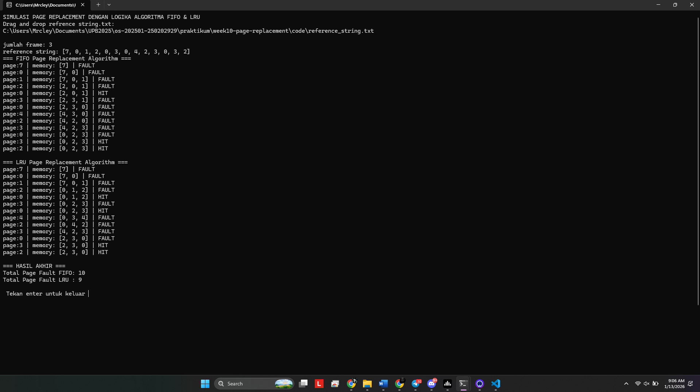

# Laporan Praktikum Minggu 10
Topik: Page replacement 

---

## Identitas
- **Nama**  : AMARUDDIN IBNU SALAM
- **NIM**   : 250202929
- **Kelas** : 1IKRA

---

## Tujuan
Setelah menyelesaikan tugas ini, mahasiswa mampu:
1. Mengimplementasikan algoritma page replacement FIFO dalam program.
2. Mengimplementasikan algoritma page replacement LRU dalam program.
3. Menjalankan simulasi page replacement dengan dataset tertentu.
4. Membandingkan performa FIFO dan LRU berdasarkan jumlah *page fault*.
5. Menyajikan hasil simulasi dalam laporan yang sistematis.


---

## Dasar Teori
1. Manajemen memori adalah mengatur penggunaan memori pada sistem operasi agar dapat menjalankan banyak proses secara bersamaan secara efisien, konsep yang digunakan oleh sistem operasi modern adalah virtual memori, yaitu mengambil sebagian kapasitas disk untuk menjadikan ram tambahan, yang memungkinkan menjalankan program yang berukuran lebih besar dari memori utama, pada virtual memori membagi ruang proses menjadi unit kecil dengan ukuran tetap yang dinamakan *page sedangkan pada memori utama di bagi menjadi *frame*.

2. Page fault adalah fenomena ketika sebuah proses yang akan di akses tidak sedang berada pada memori utama, jika terjadi page fault sistem operasi akan:
   - Menjeda  eksekusi proses 
   - Memuat page yang dibutuhkan dari media penyimpanan (*Disk*)
   - Menempatkan page pada frame memori utama (*Ram*)
   - Melanjutkan eksekusi proses.
   setelah semua frame memori terisi sistem operasi akan memilih page lain untuk diganti,proses ini dinamakan *page replacement*

3. page replacement adalah algoritma pergantian blok memori *page* dalam sistem operasi yang menentukan page mana yang dari virtual memori (*swap space*) yang akan di pindahkan kedalam memori utama (*RAM*) atau sebaliknya, ketika kondisi memori utama hampir penuh untuk mengoptimalkan penggunaan memori dan mengurangi resiko page fault. contohnya : FIFO & LRU

3. Algoritma FIFO (first in first out) merupakan algoritma yang paling sederhana, prinsip kerjanya adalah mengganti *halaman* yang pertama kali masuk ke memori tanpa memperhatikan apakah *halaman* tersebut sering du gunakan atau tidak 
   Karakteristik FIFO
   - Implementasi sederhana 
   - Tidak membutuhkan riwayat penggunaan *halaman*
   - Tidak mempertimbangkan pola akses program 
   Kelemahan FIFO 
   FiFo memiliki fenomena *Belady's Anomaly* yaitu kondisi dimana penambahan jumlah frame akan menyebabkan peningkatan jumlah page fault, karena FIFO tidak memperhatikan tingkat kepentingan dan riwayat penggunaan page.
4. Algoritma LRU (least recently used) merupakan algoritma dengan prinsip localty of reference yaitu program akan mengakses halaman yang sama pada virtual memori pada waktu yang berdekatan.
   Karakteristik LRU
   -  Algoritma LRU mempertimbangkan riwayat penggunaan page 
   -  Lebih adaptif terhadap pola akses program
   -  Algoritma ini lebih minim mengharilkan page fault dari pada algoritma FIFO.
   Kelemahan
   - Implementasi lebih kompleks 
   - Membutuhkan pencatatan riwayat penggunaan page 

## Ketentuan teknis pogram 
- Bahasa program yang di gunakan adalah **Python**
- Prgram ini berbasis **terminal**

Strukture folder 
```
week10-page-replacement
 ┣ code
 ┃ ┣ example.txt
 ┃ ┣ reference_string.txt
 ┃ ┗ SIMULASI PAGE REPLACEMENT FIFO & LRU.py
 ┣ screenshots
 ┃ ┗ example.png
 ┗ laporan.md
```
---
## Dataset Uji
```
7, 0, 1, 2, 0, 3, 0, 4, 2, 3, 0, 3, 2

frames=3
```
## Implementasi Program
Program ini di buat untuk mengetahuin perpindahan dari memori utama ke virtual memori saat mengalami *page fault* pada algoritma FIFO dan LRU berdasarkan refrence string yang diuji.
Alur program;
1. membukan program simulasi FIFO & LRU
2. drag and Drop reference string yang akan di uji 
3. program akan mulai berjalan mengindentifikasi mana page replacemnet yang mengalami *page fault* mana yang *page hit*
4. Lalu program menampilkan tabel hasil yang berisi page, memory dan status dan total jumlah page fault dan page hit setiap algoritma.


## Hasil Eksekusi


---

## Analisa Pembangding 

tabel perbandingan seperti berikut:

   | Algoritma | Jumlah Page Fault | Keterangan |
   |:--|:--:|:--|
   | FIFO |10| Algoritma ini mengganti page yang awal masuk
   | LRU | 9 | Algoritma ini mengganti page yang lama tidak digunakan

Algoritma yang paling efisien adalah LRU, karena LRU yang menghasilkan page fault paling sedikit di bandin FIFO

---

## Kesimpulan
Berdasarkan hasil simulasi di atas algoritma FIFO mengalami *page fault* karena prinsip kerjanya mengganti page yang awal masuk dan tidak memperhatikan page yang sering dipakai, sedangkan algoritma LRU lebih sedikit mengalami *page fault* karena prinsip kerja dari algoritma ini adalah dengan memperhatikan page yang sering dipakai.

---

## Quiz
1. Apa perbedaan utama FIFO dan LRU?
FIFO mengganti halaman berdasarkan urutan masuk ke memori, sedangkan LRU mengganti halaman yang paling lama tidak digunakan.
2. Mengapa FIFO dapat menghasilkan Belady’s Anomaly?
Karena FIFO tidak memperhatikan pola penggunaan halaman, sehingga penambahan jumlah frame justru dapat meningkatkan page fault.
3. Mengapa LRU umumnya menghasilkan performa lebih baik dibanding FIFO?
Karena LRU memanfaatkan prinsip locality of reference, sehingga halaman yang sering digunakan akan dipertahankan lebih lama di memori.

---

## Refleksi Diri
Tuliskan secara singkat:
- Apa bagian yang paling menantang minggu ini?  
- Bagaimana cara Anda mengatasinya?  

---

**Credit:**  
_Template laporan praktikum Sistem Operasi (SO-202501) – Universitas Putra Bangsa_
