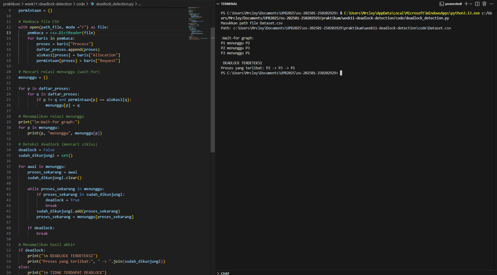

# Laporan Praktikum Minggu 11
Topik: Simulasi dan Deteksi Deadlock

---

## Identitas
- **Nama**  : AMARUDDIN IBNU SALAM  
- **NIM**   : 250202929 
- **Kelas** : 1IKRA

---

## Tujuan
Setelah menyelesaikan tugas ini, mahasiswa mampu:
1. Membuat program sederhana untuk mendeteksi deadlock.  
2. Menjalankan simulasi deteksi deadlock dengan dataset uji.  
3. Menyajikan hasil analisis deadlock dalam bentuk tabel.  
4. Memberikan interpretasi hasil uji secara logis dan sistematis.  
5. Menyusun laporan praktikum sesuai format yang ditentukan.

---

## Dasar Teori
1. Deadlock terjadi ketika dua proses atau lebih saling menunggu resource yang sedang  digunakan oleh proses lain sehingga proses tidak ada satu pun proses yang dapat melanjutkan eksekusi.
2. Deadlock dapat terjadi ketika empat kondisi terpenuhi yaitu: mutual exclusion, hold and wait, no preemption, circual wait.
3. Deteksi deadlock dilakukan dengan menganalisis alokasi resource saat ini dan permintaan dari proses-proses untuk mengetahui apakah ada proses yang tidak bisa menyelesaikan eksekusinya, yang menandakan adanya deadlock.

## Langkah Praktikum
Langkah-langkah yang di lakukan:
1. Menyiapkan Dataset 
2. Jalankan Program Deadlock Detection
3. Validasi & Analisa Hasil
4. Commit Push
---

# Ketentuan Teknis 
- Bahasa program yang dipakai Python
- Program  berbasis terminal non GUI
- Program ini fokus untuk mendeteksi deadlock

Struktur folder:
```
week11-deadlock-detection
 ┣ code
 ┃ ┣ Dataset.csv
 ┃ ┗ deadlock_detection.py
 ┣ screenshots
 ┃ ┗ Hasil_Eksekusi.png
 ┗ laporan.md
```
## Langkah Pengerjaan
1. **Menyiapkan Dataset**

   Gunakan dataset sederhana yang berisi:
   - Daftar proses  
   - Resource Allocation  
   - Resource Request / Need

   Contoh tabel:

   | Proses | Allocation | Request |
   |:--:|:--:|:--:|
   | P1 | R1 | R2 |
   | P2 | R2 | R3 |
   | P3 | R3 | R1 |

2. **Implementasi Algoritma Deteksi Deadlock**

   Program minimal harus:
   - Membaca data proses dan resource.  
   - Menentukan apakah sistem berada dalam kondisi deadlock.  
   - Menampilkan proses mana saja yang terlibat deadlock.

3. **Eksekusi & Validasi**

   - Jalankan program dengan dataset uji.  
   - Validasi hasil deteksi dengan analisis manual/logis.  
   - Simpan hasil eksekusi dalam bentuk screenshot.

4. **Analisis Hasil**

   - Sajikan hasil deteksi dalam tabel (proses deadlock / tidak).  
   - Jelaskan mengapa deadlock terjadi atau tidak terjadi.  
   - Kaitkan hasil dengan teori deadlock (empat kondisi).

5. **Commit & Push**

   ```bash
   git add .
   git commit -m "Minggu 11 - Deadlock Detection"
   git push origin main
   ```
---

## Hasil Pengujian


## Analisis

Hasil eksekusi program menunjukkan bahwa terdapat deadlock dengan proses:
**P1, P2, dan P3**.

| Proses | Status |
|------|--------|
| P1 | Deadlock |
| P2 | Deadlock |
| P3 | Deadlock |

---
Deadlock terjadi karena keempat kondisi deadlock terpenuhi:
1. Mutual Exclusion, setiap resource bersifat eksklusif satu proses dalam satu waktu tidak dapat digunakan oleh proses lain.
2. Hold and Wait, setiap proses menahan satu resource dan Sambil menunggu resource lain.
3. No Preemption, resource tidak dapat di ambil secara paksa oleh sistem, resource dapat digunakan oleh proses lain jika proses sudah selesai.
4. Circular Wait, terjadinya siklus menunggu 
   P1 menunggu P2
   P2 menunggu P3
   P3 menunggu P1
   Tidak ada proses yang bisa bergerak maju karena menunggu satu sama lain.

## Kesimpulan 
Berdasarkan hasil simulasi dan analisis dataset yang digunakan, dapat disimpulkan bahwa sistem berada dalam kondisi deadlock. Hal ini terjadi karena semua proses sedang menunggu sumber daya yang sedang digunakan oleh proses lain, sehingga mencegah proses mana pun untuk melanjutkan eksekusinya.

Dataset yang diuji memenuhi keempat kondisi terjadinya deadlock: mutual exclusion, hold and wait, no preemption, dan circular wait. Pembentukan siklus menunggu antar proses (P1 → P2 → P3 → P1) merupakan penyebab utama terjadinya deadlock.

Program deteksi deadlock berhasil mengidentifikasi kondisi ini dengan membangun hubungan menunggu antar proses dan mendeteksi keberadaan siklus. Dengan demikian, tujuan praktikum yaitu memahami konsep dan mekanisme deteksi deadlock telah tercapai.

---
### Quiz
1. Apa perbedaan antara *deadlock prevention*, *avoidance*, dan *detection*? 

   Perbedaan prevention, avoidance, dan detection
   - **Prevention**: Mencegah salah satu kondisi deadlock
   - **Avoidance**: Menghindari deadlock dengan pengecekan state aman
   - **Detection**: Membiarkan deadlock terjadi lalu mendeteksinya

2. Mengapa deteksi deadlock tetap diperlukan dalam sistem operasi? 

   Karena tidak semua sistem dapat mencegah atau menghindari deadlock akibat
   keterbatasan resource dan performa.

3. Apa kelebihan dan kekurangan pendekatan deteksi deadlock?

   Kelebihan dan kekurangan deteksi deadlock

   **Kelebihan:**
   - Lebih fleksibel
   - Resource lebih efisien

   **Kekurangan:**
   - Deadlock sudah terlanjur terjadi
   - Membutuhkan recovery tambahan

---

## Refleksi Diri
Tuliskan secara singkat:
- Apa bagian yang paling menantang minggu ini?  
- Bagaimana cara Anda mengatasinya?  

---

**Credit:**  
_Template laporan praktikum Sistem Operasi (SO-202501) – Universitas Putra Bangsa_
