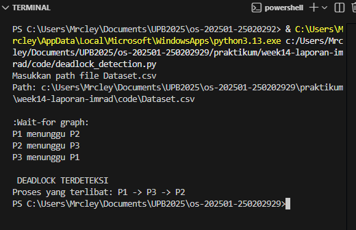

# Tugas Praktikum Minggu 14  
Topik: Penyusunan Laporan Praktikum Format IMRAD

---

## Identitas
- **Nama**  : AMARUDDIN IBNU SALAM 
- **NIM**   : 250202929 
- **Kelas** : IKRA

---
## Pendahuluan (Introduction)
Deadlock merupakan kondisi pada sistem operasi di mana sekumpulan proses saling menunggu sumber daya yang sedang dipegang oleh proses lain, sehingga tidak ada satu pun proses yang dapat melanjutkan eksekusinya. Masalah deadlock menjadi penting karena dapat menyebabkan sistem berhenti merespons dan menurunkan kinerja secara keseluruhan.

Salah satu pendekatan untuk mendeteksi deadlock adalah dengan menggunakan **wait-for graph**. Pada graf ini, setiap simpul merepresentasikan proses, dan sisi berarah menunjukkan bahwa suatu proses sedang menunggu proses lain untuk melepaskan sumber daya. Deadlock dapat dideteksi dengan mencari **siklus** pada graf tersebut.

Tujuan dari praktikum ini adalah:
1. Mengimplementasikan deteksi deadlock menggunakan pendekatan wait-for graph.
2. Menganalisis relasi antar proses berdasarkan alokasi dan permintaan resource.
3. Menentukan apakah deadlock terjadi berdasarkan siklus pada graf.

---
**Struktur folder week14-laporan-imrad**
```
week14-laporan-imrad
 ┣ code
 ┃ ┣ Dataset.csv
 ┃ ┣ deadlock_detection.py
 ┃ ┗ example.txt
 ┣ screenshots
 ┃ ┗ image.png
 ┗ laporan.md
 ```

## Metode 

### Lingkungan Uji
- Sistem Operasi: Windows 11 
- Bahasa Pemrograman: Python 3.13
- Library tambahan: `csv`
- Media input: File `Dataset.csv`

### Dataset 
Dataset berisi informasi proses, resource yang sedang dialokasikan, dan resource yang diminta oleh masing-masing proses.

   **Dataset.csv**
   ```bash
   Process,Allocation,Request
   P1,R1,R2
   P2,R2,R3
   P3,R3,R1
   ```  

## Langkah Praktikum
- Membaca file CSV untuk memperoleh data proses, alokasi, dan permintaan resource.
Membentuk wait-for graph berdasarkan kondisi:
   - Wait-for graph:
      Proses p tidak bisa lanjut kerja karena resource yang dia butuhkan masih dipakai oleh proses q.
- Menelusuri wait-for graph untuk mendeteksi adanya siklus.
- Menentukan keberadaan deadlock berdasarkan hasil penelusuran.


## Hasil Eksekusi



Wait-For Graph
Berdasarkan dataset yang digunakan, relasi menunggu antar proses adalah sebagai berikut:

| Proses | Menunggu Proses |
| ------ | --------------- |
| P1     | P2              |
| P2     | P3              |
| P3     | P1              |

Program mendeteksi adanya siklus pada wait-for graph, sehingga dapat disimpulkan bahwa sistem berada dalam kondisi deadlock.

```bash
DEADLOCK TERDETEKSI
Proses yang terlibat: P1 -> P2 -> P3
```

## Analisis
Hasil eksperimen menunjukkan bahwa ketiga proses saling menunggu secara melingkar, di mana setiap proses meminta resource yang sedang dialokasikan ke proses lain. Kondisi ini memenuhi salah satu syarat terjadinya deadlock, yaitu circular wait.
Pendekatan wait-for graph efektif untuk mendeteksi deadlock pada sistem dengan satu instance resource untuk setiap jenis resource. Keberadaan siklus pada graf secara langsung mengindikasikan deadlock.

Namun, implementasi ini memiliki keterbatasan, antara lain:
- Tidak mendukung lebih dari satu resource per proses.
- Tidak menangani kasus multiple instance resource.
- Relasi menunggu disederhanakan hanya satu arah per proses.

Meskipun demikian, eksperimen ini telah berhasil menunjukkan konsep dasar deteksi deadlock sesuai dengan teori sistem operasi.


## Kesimpulan
- Deadlock dapat dideteksi menggunakan pendekatan wait-for graph.
- Siklus pada wait-for graph menandakan terjadinya deadlock.
- Dataset yang diuji menghasilkan kondisi circular wait antar proses.
- Implementasi sederhana ini efektif untuk memahami konsep dasar deadlock dalam sistem operasi.
---

## Quiz
1. Mengapa format IMRAD membantu membuat laporan praktikum lebih ilmiah dan mudah dievaluasi?

   **Jawaban** : Karena format IMRAD menyajikan laporan secara sistematis mulai dari latar belakang, metode, hasil, hingga analisis, sehingga memudahkan pembaca untuk memahami dan mengevaluasi eksperimen.
2. Apa perbedaan antara bagian Hasil dan Pembahasan?
   
   **Jawaban** : Bagian Hasil menyajikan data dan temuan eksperimen secara objektif, sedangkan Pembahasan berisi interpretasi, analisis, dan keterkaitan hasil dengan teori.
3. Mengapa sitasi dan daftar pustaka penting, bahkan untuk laporan praktikum?

   **Jawaban** : Sitasi dan daftar pustaka menunjukkan dasar teori yang digunakan, meningkatkan kredibilitas laporan, serta menghindari plagiarisme.

---

## Refleksi Diri
Tuliskan secara singkat:
- Apa bagian yang paling menantang minggu ini?  
- Bagaimana cara Anda mengatasinya?  

---
## Daftar Pustaka

Silberschatz, A., Galvin, P. B., & Gagne, G. (2018). Operating System Concepts (10th ed.). Wiley.

Tanenbaum, A. S., & Bos, H. (2015). Modern Operating Systems (4th ed.). Pearson.

Arpaci-Dusseau, R. H., & Arpaci-Dusseau, A. C. Operating Systems: Three Easy Pieces (OSTEP). 

**Credit:**  
_Template laporan praktikum Sistem Operasi (SO-202501) – Universitas Putra Bangsa_
